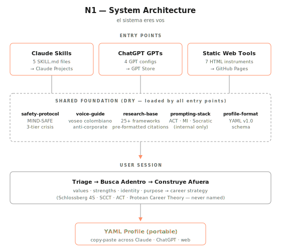

# FOR BUILDERS

> For people who want to replicate the pattern, not use the tool.

If you landed here to *use* N1 as a career tool, wrong door — open [README.md](README.md) instead.

If you're here because you want to build your own N-of-something (research-backed, AI-delivered, YAML-portable across Claude / ChatGPT / web), this is your map.

---

## What this repo is, in one paragraph

An AI-delivered methodology for career self-knowledge, built on top of 25+ validated psychological frameworks. Three entry points (Claude Skills, ChatGPT GPTs, static HTML tools) share a single foundation (safety, voice, research citations, prompting stack) and a single portable artifact (a YAML profile the user carries between tools). Zero backend, zero login, zero cost. GitHub Pages for hosting, Markdown + YAML for everything else.

## The architecture, in one picture

---

## Read in this order

The repo has ~60 docs. You don't need all of them to get the pattern. Read these 6, in order:

1. **[README.md](README.md)** — the user-facing pitch. Understand what it *is* before understanding what it's *made of*.
2. **[CLAUDE.md](CLAUDE.md)** — project constraints, tech stack, conventions, safety rules. The constitution.
3. **[shared/profile-format.md](shared/profile-format.md)** — the YAML schema that glues all three entry points together. The most load-bearing design decision in the repo.
4. **[shared/voice-guide.md](shared/voice-guide.md)** — voice rules (voseo colombiano, anti-corporate, no em-dashes in user-facing text). Shapes every user-facing string.
5. **[shared/safety-protocol.md](shared/safety-protocol.md)** — MIND-SAFE three-tier crisis detection. Non-negotiable in anything touching mental health or career anxiety.
6. **[skills/n1-system/SKILL.md](skills/n1-system/SKILL.md)** — the orchestrator. Read this last — it references everything above and shows how it composes.

After those six files, you have the pattern. Everything else is implementation detail.

---

## Patterns worth stealing

**DRY across AI platforms.** Claude Skills, ChatGPT GPTs and web tools all load from `shared/`. Never duplicate content — reference it. See [.planning/STATE.md](.planning/STATE.md) Decisions log for why.

**YAML profile as interchange format.** Every tool that produces assessment data outputs the same YAML schema. User copy-pastes between tools. No sync, no accounts, no API. Portability through clipboard. Schema lives at [shared/profile-format.md](shared/profile-format.md).

**Voice as a first-class constraint.** Voseo colombiano, anti-hustle, anti-corporate fluff, no em-dashes in user-facing text, therapeutic techniques used internally but never named externally. Defined in [shared/voice-guide.md](shared/voice-guide.md).

**Safety first, everywhere.** MIND-SAFE three-tier crisis detection runs on every user message. Scope disclaimer verbatim at every session start. Never "therapy" — always "evidence-based career guidance". Defined in [shared/safety-protocol.md](shared/safety-protocol.md).

**Measurement separated from interpretation.** Validated instruments (CAAS-12, MLQ-10, Big Five) are administered as standardized static forms. AI handles interpretation. Never conflate the two — the first is psychometrics, the second is conversation.

**Evidence base as single source of truth.** Every citation pre-approved and pre-formatted in [shared/research-base.md](shared/research-base.md). Skills cite only from this file. No made-up studies, no "research shows".

**Token budget as a design constraint.** Skills run at ~25–35K tokens per Claude session. GPTs use ~1,800 token instructions + knowledge files for RAG. Budget is why skills load only three shared files by default and why scoring tables live inline in GPT instructions (not in knowledge files).

**Full planning artifacts committed.** See [.planning/](.planning/) — `ROADMAP.md`, `STATE.md`, `PROJECT.md`, phase plans and summaries. A decision log of 70+ architectural choices with their reasoning. This is where to mine for *why*.

---

## See it run before reading the code

To install the full N1 system in your own Claude in ~5 minutes:

1. Clone this repo (or download the zips directly from `web/skills/downloads/`)
2. Open `web/skills/index.html` in a browser if you want the pretty install UI
3. Or just grab `web/skills/downloads/n1-project.zip` directly
4. In Claude (claude.ai), create a new Project
5. Open `N1-INSTRUCTIONS.md` from the zip — paste its contents into **Custom Instructions**
6. Upload all other `.md` files from the zip as **Knowledge** files (17 files total)
7. Start a conversation with *"quiero el sistema completo"*

For a single skill (lighter), use `busca-adentro.zip`, `compass.zip`, `ghost-check.zip`, `construye-afuera.zip`, or `n1-system.zip`. Each one is drag-to-install.

---

## What's not done

Be honest — the repo is paused. Check [.planning/ROADMAP.md](.planning/ROADMAP.md):

- **Phase 3 (Integration + Scorecards):** 2 of 3 plans complete
- **Phase 5 (Claude Skills Publishing):** 6 of 9 plans — eval cases done, marketplace publishing not
- **Phase 6 (GitHub Pages Deployment):** not started
- **Phase 7 (First Ship):** not started

Working code. Not shipped.

---

## If you're replicating, what to change

The pattern is domain-agnostic. To clone it for a different domain (your own N-of-X):

- Replace the frameworks in `shared/research-base.md` with the 20–30 papers from your domain
- Replace the voice in `shared/voice-guide.md` with your audience's register
- Keep the YAML profile schema — just adapt the fields
- Keep the safety protocol, or adapt if your domain has different crisis signals
- Replace the skills in `skills/` with your domain's tools
- Replace the instruments in `web/` with your domain's validated forms

If your domain has no clinical or crisis dimension, you can simplify `shared/safety-protocol.md` significantly. Everything else is the skeleton.

---

## Questions

This is a personal repo, shared for learning. No issues/PRs expected — but if you build something inspired by this, I'd love to see it. Pingame.

---

*El sistema sos vos, también.*
